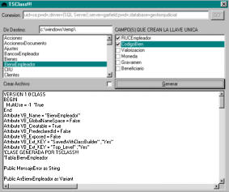



## Source Code Class Generator

### Description

This code will allow yours to create source code from a table DB into a class module.

It creates the following methods:

add records, edit records, delete records, charge records and find/fill variables from a single record.
 
### More Info
 
The ODBC String to connect to the DB

Uses RDO

Assume all the variables as String (Good for Class codification Standards thru DB engines)

The source code of the class

             |
---                |---
**Submitted On**   |2001-01-04 15:36:50
**By**             |[Grenville Tryon](https://github.com/Planet-Source-Code/PSCIndex/blob/master/ByAuthor/grenville-tryon.md)
**Level**          |Intermediate
**User Rating**    |3.9 (27 globes from 7 users)
**Compatibility**  |VB 5\.0
**Category**       |[Complete Applications](https://github.com/Planet-Source-Code/PSCIndex/blob/master/ByCategory/complete-applications__1-27.md)
**World**          |[Visual Basic](https://github.com/Planet-Source-Code/PSCIndex/blob/master/ByWorld/visual-basic.md)
**Archive File**   |[CODE\_UPLOAD13365142001\.zip](https://github.com/Planet-Source-Code/grenville-tryon-source-code-class-generator__1-14118/archive/master.zip)

